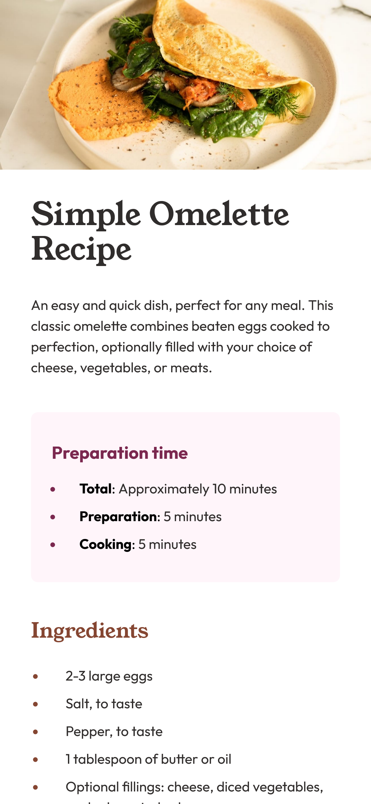

# Frontend Mentor - Recipe page solution

This is a solution to the [Recipe page challenge on Frontend Mentor](https://www.frontendmentor.io/challenges/recipe-page-KiTsR8QQKm). Frontend Mentor challenges help you improve your coding skills by building realistic projects.

## Table of contents

- [Overview](#overview)
  - [The challenge](#the-challenge)
  - [Screenshot](#screenshot)
  - [Links](#links)
- [My process](#my-process)
  - [Built with](#built-with)
  - [What I learned](#what-i-learned)
  - [Continued development](#continued-development)
  - [Useful resources](#useful-resources)
- [Author](#author)

## Overview

A frontend mentor task that requires creating a webpage for an omellette recipe. Built with vuejs and styled with tailwindcss

### Screenshot

### Links

- Solution URL: [recipe-page repo](https://github.com/mbtenkorang/recipe-page)
- Live Site URL: [recipe-app website](https://recipe-app-whxn.onrender.com/)

## My process

### Built with

- Lists
- Table
- Mobile-first workflow
- [Vue](https://vuejs.org/) - JS library
- [Vite](https://vitejs.dev/) - frontend build tool
- [TailwindCSS](https://tailwindcss.com/) - For styles

### What I learned

- Using vue directives especially v-bind and v-for
- Styling lists
- Formatting data in tables

### Continued development

- Learn to fetch data from an external file or source

### Useful resources

- [Frontend Development Projects with Vue.js 3](https://www.packtpub.com/product/frontend-development-projects-with-vue-js-3/9781803234991) - Vuejs Reference
- [TailwindCSS Documentation](https://tailwindcss.com/docs/installation) - Reference for utility styles in Tailwind

## Author

- GitHub Repo - [Moses](https://github.com/mbtenkorang)
- Frontend Mentor - [@moses](https://www.frontendmentor.io/profile/mbtenkorang)
